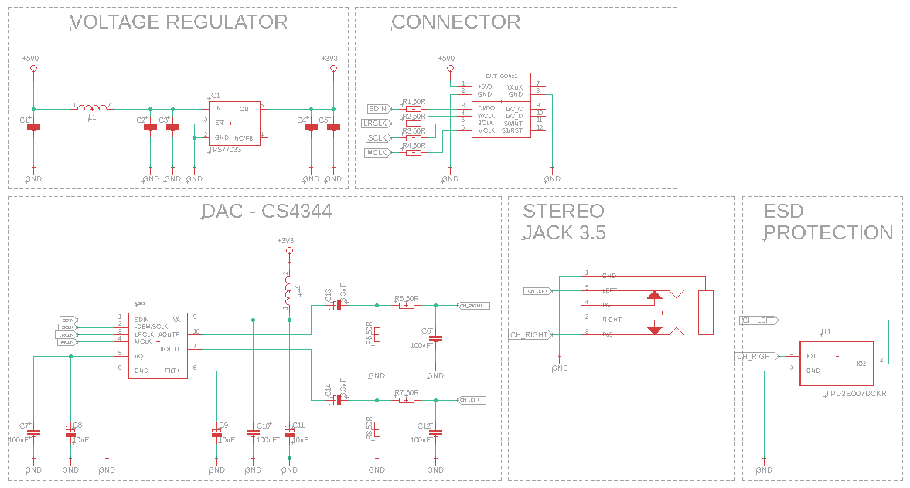
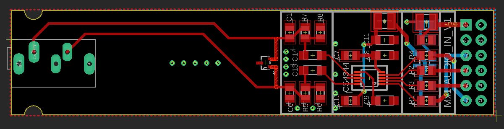

# Expansion Module: Audio Line Out with CS4344

## Overview
This repository houses the design and development of the CS4344 Audio Line Out Expansion Module, specifically engineered for integration with the SmartBoard platform. The SmartBoard, a versatile development and educational platform, facilitates learning and project development in hardware programming languages such as VHDL, Verilog, and SystemVerilog. Aimed at streamlining the complexities of FPGA interfacing, the SmartBoard enables rapid prototyping and testing of various interface supports and System on Module (SOM) concepts. The CS4344 module, featuring a compact and high-performance digital-to-analog converter (DAC), provides a superior stereo audio output capability. Designed to fit seamlessly into a single expansion slot on the SmartBoard, this module utilizes a standard I2S interface for integration, making it an exemplary choice for projects requiring high-fidelity audio playback and audio effects and filters development.

## Key Features of CS4344
- **24-bit Resolution**: Delivers high-fidelity audio with a 24-bit data converter, ensuring detailed and rich sound reproduction.
- **Stereo Audio Output**: Provides high-quality stereo sound output, significantly enhancing the audio playback experience.
- **Integrated CS4344 DAC**: Incorporates the CS4344 DAC for advanced audio performance, capable of handling sample rates up to 192 kHz, allowing for studio-quality sound.
- **SmartBoard Compatibility**: Specifically designed for the SmartBoard platform, this module fits into a single expansion slot, offering a compact and efficient audio output solution.
- **Standard I2S Interface**: Features a widely supported I2S interface for straightforward integration, facilitating ease of use with a broad array of microcontrollers and DSPs.
- **Dynamic Range**: Boasts an impressive dynamic range, catering to a wide spectrum of audio applications, from basic audio playback to complex audio processing for development and educational purposes.

## Design Documentation

Below are the key design documents for the CS4344 Audio Line Out Expansion Module, including schematic diagrams and board designs. These documents offer detailed insights into the module's architecture and layout, facilitating understanding and modifications.

### Schematic Diagram

*This is the schematic diagram of the CS4344 Audio Line Out Expansion Module, showing the connection and configuration of the CS4344 DAC and other components.*

### Board Design - 2D

*The 2D board design displays the physical layout of the module's components on the PCB, aiding in assembly and troubleshooting.*

### Board Design - 3D Visualization

*This 3D visualization provides a comprehensive view of the module, offering a clearer understanding of its physical characteristics and design considerations.*

### CS4344 DAC Documentation
For more detailed information about the CS4344 DAC, refer to the datasheet available [here](media/CS4344_45_48_F2-1141644.pdf).

## Contributions and Feedback
We welcome contributions to this project. If you have suggestions for improvement or have developed additional features, please fork the repository, make your changes, and submit a pull request. For any questions or issues, please open an issue in the GitHub repository.

## License
This audio output project is licensed under the MIT License with the following terms:

- **Permission to Use**: You are free to use, modify, and distribute this audio output design in both private and commercial settings.
- **Attribution Requirement**: While not required, attribution to the original author, Adam Łuczak, is appreciated. This can be done through a citation or a link back to this repository.
- **No Warranty**: This design is provided "as is", without warranty of any kind. Use it at your own risk.
- **Liability**: The author is not liable for any damages or losses that may arise from the use of this design.

For the full terms and conditions, please refer to the MIT License documentation.

## Contact
Should you have any inquiries or suggestions regarding this audio output project, please don't hesitate to contact Adam Łuczak at adam.luczak@outlook.com.
